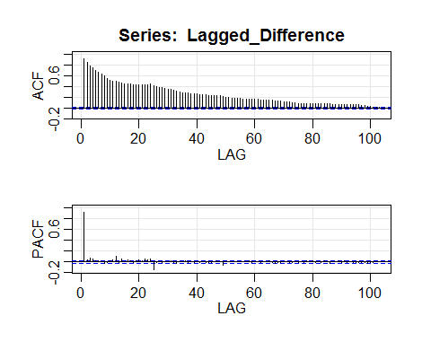
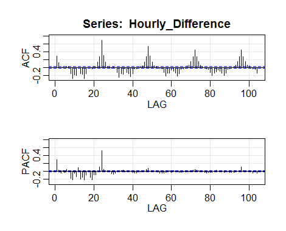
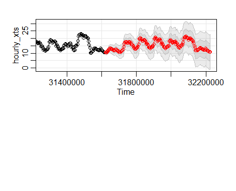

#Executive summary

* Team Colborne was approached by Algonquin Power and Utilities Company to modify their load forecasting technique at the request of the Northern Maine Independent System Administrator.

* The Team built a fully functional time series model in the R programming language that incorporates weekly and daily variations in load that reflect the nature of their industrial clients in the Maine Public Service Region.

* Additionally, the model considers regionally observed holidays as well as local temperature conditions.

* The model automatically reads in demand data from the template provided by the settlements team and converts it to useable form. Next, it accounts for missing observations in the temperature data from using a multiple imputation. Lastly, using established time-series relationships in the underlying data sets, it creates an hourly demand profile for the next seven days based on upcoming holidays and temperature data.

* The next step is to develop a testing regime for the model so that it can be further developed and tested against the current load forecasting technique.


\newpage
## *1. Problem Statement*

Algonquin Power and Utilities Corporation (APUC) owns and operates a 34 MW run-of-the-river hydroelectric facility in the Northern Maine Independent System Administrator (NMISA) power market. The dam was built in 1923 and is located just east of the US-Canada border in Tinker, New Brunswick. The company uses the power generated from the power plant to serve electric load for industrial clients in the Maine Public Service (MPS) region. The generation from the plant fluctuates with the flow in the Aroostook River, and, coupled with the variable nature of electricity demand, creates challenges for the company. When river flows are high and the available generation exceeds the electric load, the company must export the additional generation to external markets. Similarly, when river flows are low, the company must import power to serve their load obligations. Historically, load forecasting at the company has been accomplished using a simple averaging technique for similar days, but with increasing stress on the grid caused by intermittent energy sources, the System Operator has mandated that the forecasting technique capture hourly fluctuations in supply and demand. Therefore, the purpose of this project is to develop and propose an updated load forecasting methodology for the industrial clients in the Maine Public Service region that meets the requirements of the System Administrator. 

The report is separated into three sections: Data Sources, Analyisis, and Results. Throughout these sections, the team has highlighted five distinct tasks that were completed, namely:

1. Cleaning and Merging the Data
2. Dealing with Missing Data
3. Automated Model Development
4. Dealing with Error Terms
5. Forecasting Time Series Data

The findings for each of these tasks are presented from both managerial and technical perspectives so to provide the reader with a wholesome understanding of our results. While the managerial perspective speaks generally about the resulting outcomes of each task, the report emphasizes the technical perspective due to the consideration that the resulting model is likely to transition to a testing environment in the coming weeks. The intent is that the executive summary will be used primarily for presentation to the APUC management team, while the report will focus on the technical and practical considerations of deploying the model in a test environment. 

## *2. Data Sources*

To develop this model, the team sourced three data sources:

1. Hourly Electric Demand
2. Hourly Regional Temperature
3. Observed Regional Holidays

__Hourly Electric Demand Data__

Algonquin Power supplied the team with hourly electric demand data for each month of the year dating back to 2012. Subsequent discussions with the company determined that a significant number of new industrial clients were onboarded throughout 2015, and as a result,  requested that the team use only the data for the 2016 period. Each monthly data file reports the hourly electric demand in MWh in the following format:
\newpage
```{r echo = FALSE}
setwd("C:/Users/Chris Gervais/Desktop/Term Project/")
```


###*Task #1: Cleaning and Merging the Data*

__Managerial Perspective:__

Before this data could be used for analysis, the team needed to load each Excel file, read the required data, arrange the data into observations and variables, and collapse the data into a single dataframe. Furthermore, discussions with the settlements team found that these data files are manually prepared every month by copying and pasting the daily raw text files obtained from the System Administrator FTP site. It is only arranged in this format so to easily allow them to calculate the average electric demand by hour for load forecasting, and subsequent discussions with the management team discovered that this file is not used in other business processes. 

This report therefore suggests that the settlements team automate the retrieval of the FTP text files and source a database solution such as Access or MySQL to store the data in an easily accessible manner. Automated reports can easily be generated in this way, and avoids the possibility of data corruption.

__Technical Perspective:__

The R script below provides a detailed progression of the steps taken to complete this task. Comments have been added for the sake of clarity, and where external package were used, a discussion of the functions involved is presented.


```{r warning = FALSE, message = FALSE}

#First, the team set the working directory to the folder containing the electric load
#files.
setwd("C:/Users/Chris Gervais/Desktop/Term Project/Load")

#Next, a character vector called filenames was created containing a list of the 
#file names that match the .xls file type in the working directory.
filenames <- list.files(full.names = TRUE, pattern = "*.xls")
```

As expected, there are `r length(filenames)` files in the working directory, with the following names:

```{r echo = FALSE}
  filenames
```


```{r message = FALSE, warning = FALSE}

#The xlsx package allows for programatic control of Excel files using R. This package 
#was loaded using hte library command.
library(xlsx)

#Since the xlsx package uses the default working directory of RStudio, we need to once
#again specify the working directory of the load files.
setwd("C:/Users/Chris Gervais/Desktop/Term Project/Load")

#The lapply function takes as the first argument a list variable, and as the second 
#argument a function you would like to apply across the entire list. It functions 
#similar to a for loop but is faster, uses less memory, and is immune to infinite
#looping. Pass the list of filenames to the read.xlsx function within the xlsx package.
all_load_data <- lapply(filenames, function(i){read.xlsx(i,

    #The data files contain numerous sheets, we need to specify the first sheet.
    sheetIndex=1, 
            
    #Note that the data range has been statically declared. Although the number of hours 
    #in a day is static, the number of days in a month is not. This simplification will 
    #have to be corrected in subsequent steps. 
    rowIndex=c(5:28), 
    colIndex=c(2:32), 

    #Explicitly direct the read.xlsx function to return a data frame object without
    #headers.
    as.data.frame=TRUE, 
    header=FALSE)})

#For demonstration purposes, the variable data_preview shows the first six hours of 
#the first ten days.
data_preview <- all_load_data[[1]]
data_preview[1:6, 1:10]
```


```{r warning = FALSE, message = FALSE}

#Load the extensible time series (xts) package which extends the base R capabilities
#of time series (ts) objects. This package will be used to create an xts object.
library(xts)

#Next, the team created a custom function to change the list of underlying dataframes
#in all_load_data to a list of single variable vectors stored in the variable called
#change_to_single_vector. We again make use of the lapply() function but this time
#pass it an integer vector from 1 to length(all_load_data) using seq_along()
seq_along(all_load_data)

change_to_single_vector <- lapply(seq_along(all_load_data), function(i){
            
    #The function starts by initializing the data frame df_0 with the ith monthly data.
    df_0 <- all_load_data[[i]]
    
    #Next, we create a new data frame called df_1 that contains data for the first day.
    df_1 <- df_0[,1]
    
    #Using a for loop for the remaining 30 days, the script adds the remaining days by
    #concatenating df_1 on itself.
    for(j in c(2:31)){
        df_1 <- c(df_1, df_0[,j])
    }
    
#Lastly, the function explicitly returns the df_1 to the first position of the list and
#the process repeates for the remaining monthly data frames.
return(df_1)})

#Next the script takes the list of vectors, and colappses it down into a single list of 
#vectors using unlist, and converts it to a data frame using the as.data.frame()
#function.
hourly_df <- as.data.frame(unlist(change_to_single_vector))

#We can now remove the 0's that were introduced by the 31 days / month assumption using
#base R subsetting functionality.
hourly_df <- hourly_df[hourly_df$`unlist(change_to_single_vector)`!=0,]

#Create the time index of known start and end times, given by the data files.
time_index <- seq(from = as.POSIXct("2016-01-01 01:00"), 
                  to = as.POSIXct("2017-01-01 00:00"), by = "hour")   

#Create the final hourly xts object using the xts() function.
hourly_xts <- xts(hourly_df, order.by = time_index, period = 168)

#Name the first variable / column, so that we can call it later on.
names(hourly_xts) = c("Demand")

#Preview the first six hours of the final xts object.
head(hourly_xts, 6)

```

Once the electric demand data was available in the xts object, a rigourous quality control check was conducted to ensure that the newly created data object matched the original.

####*Task #2: Dealing with Missing Data*

__Managerial Perspective:__

It is widely known in the power industry that temperature is a major contributor to the demand for electricity for residential customers because heating and cooling represents a significant portion of their energy consumption. For industrial clients, however, the effect of temperature on the demand for electricity largely depends on the nature of the facility's operations. For instance, in commercial applications where the main driver of electrical demand is from large pumps or motors, outside ambient temperature may not play a critical role in energy consumption. At the time of writing this report, the makeup of the commercial clients was not well-understood, and the team therefore decided to include temperature in the modeling process.

Given that the power plant is located within close proximity to the commercial facilities that it serves, a logical data source would be to use ambient temperature sensors from the power plant. Surprisingly, the plant does not collect ambient temperature data and the team was therefore forced to source this information externally from the Government of Canada historical climate records. Ambient temperature sensors could be installed and integrated into the on-site database at minimal cost, and thus, this report recommends a follow up cost-benefit analysis be conducted to explore this possibility further.

The closest weather station to the Maine Public Service region data on an hourly frequency is located in Saint Leonard, NB. This station, although located within 60 km of the majority of the industrial clients, is only updated periodically and suffers from missing data observations. To correct for the missing data, temperatures from Edmunston and Fredericton, NB were included in the dataset. More specifically, data from the [*Saint Leonard CS*](http://climate.weather.gc.ca/climate_data/hourly_data_e.html?hlyRange=1995-05-16%7C2017-02-05&dlyRange=2001-08-16%7C2017-02-05&mlyRange=2005-12-01%7C2007-07-01&StationID=26823&Prov=NB&urlExtension=_e.html&searchType=stnName&optLimit=yearRange&StartYear=1840&EndYear=2017&selRowPerPage=25&Line=2&searchMethod=contains&Month=1&Day=1&txtStationName=St.+Leonard&timeframe=1&Year=2016
), [*Fredericton CDA CS*](http://climate.weather.gc.ca/climate_data/hourly_data_e.html?hlyRange=2004-12-30%7C2017-03-31&dlyRange=2000-06-01%7C2017-03-31&mlyRange=2000-06-01%7C2007-07-01&StationID=30309&Prov=NB&urlExtension=_e.html&searchType=stnName&optLimit=yearRange&StartYear=1840&EndYear=2017&selRowPerPage=25&Line=4&searchMethod=contains&Month=1&Day=1&txtStationName=Fredericton&timeframe=1&Year=2016), and [*Edmunston*](http://climate.weather.gc.ca/climate_data/hourly_data_e.html?hlyRange=2004-12-10%7C2017-03-31&dlyRange=2004-12-01%7C2017-03-30&mlyRange=2004-12-01%7C2007-07-01&StationID=43323&Prov=NB&urlExtension=_e.html&searchType=stnName&optLimit=yearRange&StartYear=1840&EndYear=2017&selRowPerPage=25&Line=2&searchMethod=contains&Month=1&Day=1&txtStationName=Edmun&timeframe=1&Year=2016) weather stations was collected. The three stations were used to determine the linear relationship between Saint Leonard, Fredericton, and Edmunston, and these relationships were used to compute the missing observations for each station. This process was then repeated ten times using twenty-five iterations, creating ten different data sets, each containing complete cases. Finally, linear regression models were created for each data set, the results of which were pooled together to obtain a final regression model and a complete dataset for Saint Leonard.

__Technical Perspective:__

To deal with the missing data in the Saint Leonard data set, the team used two R packages called the *Visualization and Imputatin of Missing Values (VIM)* package and the *Multivariate Imputation by Chained Equations (MICE)* package. A detailed progression of the steps taken and scripts used is presented below, and comments have been added for completeness.

```{r echo = TRUE, warning = FALSE, message = FALSE, fig.height=2.5}

#To start, the team loaded the VIM package.
library(VIM)

#The weather data obtained from the Government of Canada historical climate records
#was read into a variable called weather.
weather <- read.csv("C:/Users/Chris Gervais/Desktop/Term Project/Weather2.csv")

#Saint Leonard, Edmunston, and Fredericton are denoted using SL, ED, and FR in the
#weather data frame.
names(weather)

#An aggregated plot function aggr() was used to display the missing data. Red indicates
#missing data while blue indicates complete data. 
VIM_plot <- aggr(weather, col=c('seagreen3','red3'),
                  numbers=TRUE, sortVars=TRUE,
                  labels=names(weather), cex.axis=.7,
                  gap=3, ylab=c("Missing data","Pattern"),
                  cex.numbers = 0.7)
```

This left hand plot shows that the data sets for Saint Leonard, Edmunston, and Fredericton are missing approximately 11.5%, 3.9%, and 0.2%, respectively. Furthermore, the right hand plot indicates the pattern of the missing cases, and shows that there are no hourly observations where all three variables are missing. Next, the nature of the missing observations was explored further using the *ggplot2* and *gridExtra* packages in R.

```{r echo = TRUE, warning = FALSE, message = FALSE, fig.width=10,fig.height=6}

#Load the ggplot2 and gridExtra packages.
library(ggplot2)
library(gridExtra)

#Create default axis labels that can be applied to each plot.
ylabel <- "Temperature (Degrees C)"
xlabel <- "Time"

#Create the plot for Saint Leonard using the ggplot() function and the time_index object
#we created in the first task.
SL_plot <- ggplot(weather, aes(x = time_index, y = weather$SL)) +
  ylab(ylabel) + 
  xlab(xlabel) + 
  ggtitle("Saint Leonard") + 
  geom_point()

#Create the plot for Fredericton using the ggplot() function and the time_index object
#we created in the first task.
FR_plot <- ggplot(weather, aes(x = time_index, y = weather$FR)) +
  ylab(ylabel) + 
  xlab(xlabel) + 
  ggtitle("Fredericton") + 
  geom_point()

#Create the plot for Edmunston using the ggplot() function and the time_index object
#we created in the first task.
ED_plot <- ggplot(weather, aes(x = time_index, y = weather$ED)) +
  ylab(ylabel) + 
  xlab(xlabel) + 
  ggtitle("Edmunston") + 
  geom_point()

#Use the grid.arrange() function from the gridExtra package to line up the plots for 
#visual effect.
grid.arrange(SL_plot, FR_plot, ED_plot, nrow = 3, ncol = 1, 
  bottom = "Figure 2. Hourly temperature data for Saint Leonard, Fredericton and Edmunston.")
```

The resulting plots suggest that a large, consecutive portion of the Saint Leonard data is missing in the month of August. This result could be explained by a communication failure, an instrumentation failure, or even a combination of the two. Fortunately, the data for Fredericton and Edmunston over the same time horizon does not exhibit the same pattern. To fix the missing data, the team used multiple imputation using the *mice* package. Ten imputations were completed using 25 iterations each. The resulting regression equation and the completed data set are presented below.

```{r eval = FALSE, include = FALSE, warning = FALSE, message = FALSE}

#Load the MICE package.
library(mice)

#Pass the data frame weather to the mice() function to create a variable called
#imputed_Data, consisting of a list of ten complete case data sets.
imputed_Data <- mice(data = weather, 
            
    #Create ten imputations with twenty-five iterations each using linear regression.
    m=10, maxit = 25, method = 'norm.predict',
    
    #A seed is used so that others can recreate the same datasets.
    seed = 500)

#Pass the data sets in imputed_Data to a linear regression model to create a variable
#called fit that contains a linear regression model for each data set.
fit <- with(data = imputed_Data, exp = lm(SL ~ FR + ED))

#Pool the results of fit into a final linear regression model called final_fit.
final_fit <- pool(fit)
```

```{r include = FALSE, warning = FALSE, message = FALSE}
library(mice)
imputed_Data <- mice(weather, m=10, maxit = 25, method = 'norm.predict', seed = 500)

fit <- with(data = imputed_Data, exp = lm(SL ~ FR + ED))
final_fit <- pool(fit)
SL_New <- complete(imputed_Data,10)
```

```{r warning = FALSE, message = FALSE, fig.height=1.75}
#Create a final completed data set for Saint Leonard called SL_New, and summarize the
#final regression fit for future use.
SL_New <- complete(imputed_Data,10)
summary(final_fit)

#Plot the final completed data set for Saint Leonard.
ggplot(weather, aes(x = time_index, y = SL_New$SL))+
    ylab(ylabel) + 
    xlab(xlabel) + 
    ggtitle("Completed Saint Leonard Data Set") + 
    geom_line()
```

Note that the p-values for the parameter estimates for both Fredericton and Edmunston are significant, and the resulting completed Saint Leonard data set appears to fit well with the overall trend in the regional temperatures.

The final step in the data source section is to read in the observed regional holiday data set, provided by the HR department at APUC, and merge all three data sources into one.

```{r warning = FALSE, message = FALSE}

#Create a binary variable called holidays and read the file from the working directory.
holidays <- read.csv("C:/Users/Chris Gervais/Desktop/Term Project/holiday.csv")

#Select only the holiday column from the underlying data set.
holidays <- holidays[,2]

#Merge the temperature and holiday data sets into a final variable called xreg which
#will be used as the regression terms in the time series analysis.
xreg <- cbind(holidays, SL_New$SL)
names(xreg) <- c("Demand", "Holiday", "Temperature")

#Display the first six items in xreg, representing the first six hours in January 2016.
head(xreg)
```
\newpage
## *3. Analysis*

The following plot shows the hourly electric demand from APUC's industrial customers in 2016. 

```{r warning = FALSE, message = FALSE, echo = FALSE, fig.height=2.5}
ggplot(hourly_xts, aes(x=time_index,y=hourly_xts))+geom_line()+xlab("Time")+ylab("Hourly Demand (MW)") +ggtitle("Hourly Demand for Electricity in 2016")
```

Over this longer term horizon, it is not immediately obvious that there is an overall trend in the data set. A closer look at the individual month of June, pictured below, shows that there is clearly both a weekly and hourly trend in the data. Weekdays typically have a higher demand profile than weekends, and daytime hours typically have a higher demand profile than overnight hours. Modeling this type of multiseasonal behaviour in time series data is not a trivial task, so the team decided to start with an automated model from an established R package.

```{r warning = FALSE, message = FALSE, echo = FALSE, fig.height=2.5}
library(ggplot2)
june <- hourly_xts[.indexmon(hourly_xts)==5,]
june_hours <- time_index[.indexmon(hourly_xts)==5]
ggplot(june, aes(x=june_hours, y=june))+geom_line()+xlab("Time")+ ylab("Hourly Demand (MW)")+ggtitle("Hourly Demand for June 2016")
```

####*Task #3: Automated Model Development:*

The team decided to use the R package *forecast* as the starting point for building the time series model. This package has automated the process of creating both exponential smoothing and autoregressive integrated moving average (ARIMA) models, and makes forecasting simple time series data accessible through the *ets()* and *auto.arima()* functions. The following section summarizes the results of these two functions.

__Managerial Perspective:__
```{r include = FALSE, echo = FALSE, warning = FALSE, message = FALSE, fig.height = 2.5}
library(forecast)
auto_ets_model <- ets(hourly_xts)
auto_ets_forecast <- forecast(auto_ets_model, h=168)
auto_ets_plot <- plot(auto_ets_forecast)
auto_ets_day1 <- auto_ets_forecast$mean[1:24]

auto_arima_model <- auto.arima(hourly_xts)
auto_arima_forecast <- forecast(auto_arima_model, h=168)
auto_arima_plot <- plot(auto_arima_forecast)
auto_arima_day1 <- auto_arima_forecast$mean[1:24]
```
The most important outcome of this modeling excercise is that APUC be able to use the forecasting technique to balance the hourly supply of the available hydroelectric output with the hourly demand of electricity from the commercial and industrial customers. If they can better forecast their requirements to serve the electric demand in the region, they can better optimize the profitability of the asset through timely imports and exports. In short, the hourly profile of the load forecast is critically important. 

Upon review of the *ets()* and *auto.arima()* models, it became apparent that more sophisticated modeling tools would be required in order for the model to be useful to the company. For example, the twenty-four hour forecasts from both the *ets()* and *auto.arima()* forecasts, presented below, show that the best prediction for the next day hourly demand is approximately 10 MW for each hour. While both models provide a reasonable estimate for the hourly demand, they are not useful from a business context.

```{r echo=TRUE}
#The first 24 hour forecast of the automated exponential smoothing model:
auto_ets_day1

#The first 24 hour forecast of the automated ARIMA model:
auto_arima_day1
```

__Technical Perspective:__

The following scripts were used to create the automated models with the *forecast* package, and subsequently forecast the first week of January 2017 hourly demand. Finally, the summary statistics for both models are presented.

```{r , warning = FALSE, message = FALSE, fig.height = 3}

#Load the forecast package.
library(forecast)

#Use the ets() function with the hourly demand to determine the best fit for an
#exponential smothing model.
auto_ets_model <- ets(hourly_xts)

#Use the automated ets() model to forecast the next week of hourly demand.
auto_ets_forecast <- forecast(auto_ets_model, h=168)

#Provide summary statistics on the automated ets() model.
summary(auto_ets_model)

#Use the auto.arima() function with the hourly demand to determine the best fit for
#a non-seasonal ARIMA model.
auto_arima_model <- auto.arima(hourly_xts)

#Use the automated auto.arima() model to forecast the next week of hourly demand.
auto_arima_forecast <- forecast(auto_arima_model, h=168)

#Provide summary statistics on the automated auto.arima() model.
summary(auto_arima_model)

#Plot both forecasts using the plot function in base R.
auto_ets_plot <- plot(auto_ets_forecast, xaxt = "n")
auto_arima_plot <- plot(auto_arima_forecast, xaxt ="n")
```

Although both the Akaike Information Criterion (AIC) and Bayesian Information Criterion show that the automated ARIMA model outperforms the exponential smoothing model, it is clear that neither are useful to the business. Future iterations of these models may consider using dummy variables for both the day of the week and the hour the day, but a more appropriate technique may be to explicitly build a seasonal ARIMA model mixed with explanatory variables. 

####*Task #4: Dealing with Error Terms*

While the *forecast* package is helpful in automating the model development process, there are other packages available that provide more control to the user. One such package is called *astsa*, which is capable of building seasonal ARIMA models with any lag and any number of explanatory variables. The following section uses the tools available in this package to develop a more appropriate model.

__Managerial Perspective:__

Rather than allowing the automated model selection process to determine the most statistically relevant model, an alternative model using a forced time lag was created on the basis of business accumen. The main drawback of the previous models were that they were unable to account for the seasonality resulting from both the day of the week fluctuations as well as the hourly fluctuations each day. Rather than attempt to disentangle two seasonal components, the team decided instead to consider a lag of 168 hours, effectively accounting for both at the same time. Although this approach may not produce the most accurate results, it most certainly guarantees that the results will be usable. To accomplish this task, the team followed the steps outlined in the *astsa* package, the details of which are presented in the technical perspective below.


__Technical Perspective:__

To begin, the team first determined if the data is stationary using the Augmented Dickey Fuller (ADF) test to test for unit roots. The ADF test uses the null hypothesis that the data is stationary, and an alternative that the data is not stationary. If the data is not stationary, we need to perform a transformation such as taking a first difference before continuing. The ADF test in the *astsa* package allows the user to select a lag to test if the seasonality is stationary as well.

```{r message = FALSE, warning = FALSE}

#Load the tseries and astsa packages.
library(tseries)
library(astsa)

#Run the ADF test using the default lag of 1 and the seasonal lag of 168. Note that we 
#use 168 to indicate the weekly seasonality.
adf.test(hourly_xts)
adf.test(hourly_xts, k = 168)
```

While the seasonal ADF test did not reject the null hypothesis, the non-seasonal ADF test suggests that we should reject the hypothesis. In this scenario, the *astsa* package suggests to use the results of the component you would most ideally like to model, or in our case, the seasonally lagged ADF test. 

Next, the package calls for a review of the both the seasonal and non-seasonal Autocorrelation Function (ACF) and Partial Autocorrelation Function (PACF) output graphs to determine the order of the ARIMA models. If the PACF output cuts off dramatically at lag k, while the ACF output tails off slowly, it suggests the model can be best defined as an autoregressive model of order k. If, on the other hand, the ACF cuts off dramatically at lag k while the PACF tails off slowly, it suggests the model is best defined as a moving average model at lag k. This exercise is best demonstrated using our data set as an example.

```{r message = FALSE, warning = FALSE, eval = FALSE}
#Extract the core data from the hourly_xts object.
core <- coredata(hourly_xts)

#Select only the electric demand data.
core <- core[,1]

#Create an hourly difference data set for the PACF and ACF functions.
Hourly_Difference <- diff(core, 1)

#Create a lagged difference data set for the PACF and ACF functions.
Lagged_Difference <- diff(core, 168)

#Plot both sets of graphs using the acf2() function in the astsa package.
acf2(Hourly_Difference)
acf2(Lagged_Difference)
```
```{r echo = FALSE}
setwd("C:/Users/Chris Gervais/Desktop/Term Project/")
```


For the hourly demand data set, the seasonal component is quite pronounced. The PACF plot clearly cuts off at the first lag while the ACF plot slowly tails off. Therefore, the *astsa* package recommends we use a seasonal ARIMA model of order (1,1,0) where the seasonal lag is = 168.



For the non-seasonal component, the choice is less clear as the non-seasonal component contains a mix of both autoregressive and The PACF plot appears to cut off at the first lag, while the ACF plot tails off after the second lag. Therefore, we will use a non-seasonal ARIMA model of order (1,1,2).

\newpage
####*Task #5: Forecasting Time Series Data*

__Managerial Perspective:__

The new model takes as inputs the hourly demand data, the order determined for the model in the previous section, the seasonal lag S, historical regressive terms for holiday and temperature, and the data for the upcoming period. In this case, data for the first week of January 2017 was used. It is important to note that, while the model appears to reflect the hourly and daily variation in the data, the model has not been thoroughly tested against actual data. The next steps in the development of this model is test it against real conditions to determine the performance. 

__Technical Perspective:__
Now that the order of the seasonal ARIMA model has been chosen, we can add the regressive data frame to the model and pass it new data. The *astsa* package makes this surprisingly simple, and is accomplished using the R commands below. 

```{r warning = FALSE, message = FALSE, eval = FALSE}
#Load the new xreg term file.
xreg_New <- read.csv("C:/Users/Chris Gervais/Desktop/Term Project/new_xregs.csv")

#Use the sarima.for() function in the astsa package to forecast the next 168 hours.
sarima.for(hourly_xts, 1,1,2,1,1,0, S= 168, 
           xreg = xreg, xreg.for = xreg_New,
           n.ahead=168)
```
